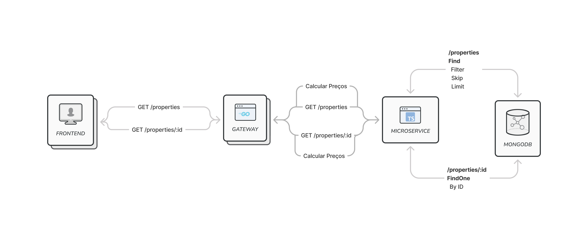

# teste

# Desafio de Fullstack Pleno

Este é um teste de avaliação para a posição de Fullstack Pleno. Você será solicitado a trabalhar em uma aplicação com React, Golang e Node.js, onde há alguns bugs que devem ser resolvidos. Os bugs serão relatados logo a baixo e você deverá corrigir cada um deles.

Além disso, como um desafio adicional, você terá a oportunidade de refatorar a página inicial para incluir uma funcionalidade de paginação em uma lista.

## Instruções

### Frontend

1. Abra o diretório da aplicação no terminal.
2. Execute o comando `npm install` ou `yarn install` para instalar as dependências.
3. Inicie o servidor de desenvolvimento do front-end executando `npm run dev` ou `yarn dev`.
4. Abra o navegador e acesse `http://localhost:3000` para visualizar a aplicação.

### Gateway

1. Abra o diretório da aplicação no terminal.
2. Build a aplicação com docker `docker build -t fullstack/gateway .`
3. Execute a aplicação com docker `docker run --name gateway -p 5000:5000 fullstack/gateway`
4. Abra o navegador e acesse `http://localhost:5000/docs` para visualizar o swagger.

### microservico

1. Abra o diretório da aplicação no terminal.
2. Execute o comando `npm install` ou `yarn install` para instalar as dependências.
3. Inicie o servidor de desenvolvimento do front-end executando `npm run dev` ou `yarn dev`.
4. Execute o mongodb utilizar `docker-compose up -d`.
5. Para popular o banco de dados utilize o arquivo `seed.json`, abra o MongoDB Compass e acesse a collection em `fullstack.properties`.
6. Clique em `ADD DATA` e depois na opção `Import JSON or CSV file` e importe o arquivo `seeds.json`.
7. Acesse `http://localhost:4000` para realizar suas requisições.

## Diagrama das funcionalidades

## [Bugs] Problemas reportados

Nesta seção, você encontrará uma lista de bugs que precisam ser corrigidos na aplicação. Você deverá resolver cada um desses bugs através de `**live coding**`, onde você terá a oportunidade de demonstrar suas habilidades de resolução de problemas em tempo real. Você pode consultar a internet para ajudá-lo durante o processo.

- [ ] Ao clicar no card da propriedade, não está redirecionando para os detalhes dela em `/properties/:id`
- [ ] Os valores da assinatura não estão de acordo com o total na tela de detalhes da propriedade.
- [ ] Quando uma das informações da propriedade vier zerada, todo o texto deverá ser riscado.

## [Feature] **Implementação de Paginação**

A aplicação atualmente exibe todas as propriedades em uma única lista na página inicial. No entanto, devido ao aumento no número de propriedades, surgiu a necessidade de implementar uma funcionalidade de paginação, dividindo as propriedades em páginas menores.

Para essa funcionalidade, você pode seguir a seguinte abordagem:

1. Crie um componente `Pagination` em `src/components/pagination/*`.
2. Modifique a função de requisição para aceitar parâmetros `page` e `limit`.
3. Persista os parâmetros `page` e `limit` para não perder a pesquisa.
4. Dê suporte no `microservico` para os query params de `page` e `limit`.

Ou implemente um scroll infinito.

> Obs: Esta liberado utilizar bibliotecas terceiras ou fazer do zero.

Implementar essa funcionalidade de paginação melhorará a usabilidade da aplicação à medida que o número de propriedades aumenta.

## Considerações Finais

- Não se preocupe em implementar recursos adicionais além dos mencionados.
- O foco principal deste teste é avaliar sua habilidade em identificar e corrigir bugs em um ambiente de live coding.
- Valorizamos a clareza e a organização do código, bem como boas práticas de desenvolvimento.
- Ao concluir o teste, faça um commit das suas alterações e envie o link do seu repositório para avaliação.

Boa sorte! Divirta-se resolvendo os desafios e não hesite em entrar em contato caso tenha alguma dúvida.
